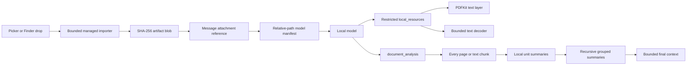

# Document Attachments

## Product behavior

PrivateAI imports selected documents into managed local storage and associates them with a user message. Exact local details use bounded `local_resources` reads or searches. Whole-document summaries and reviews use `document_analysis`, which summarizes every extractable PDF page or text chunk to private local checkpoints and recursively reduces those summaries until one bounded result remains. Document bytes and extracted text are not stored in message rows or eagerly inserted into every model request.

Users can select multiple documents from the composer or drop Finder file URLs onto it. Import must finish before send. A turn requires a non-empty user request and accepts up to 8 documents of 20 MiB each.

## Implemented formats

The first release supports 9 document categories represented by 38 filename extensions. The categories describe parser behavior; they are not 38 independent parsers.

| Category | Extensions | Reader behavior |
| --- | --- | --- |
| PDF | `pdf` | PDFKit text layer, page ranges, page-local continuation, page search |
| Markdown | `md`, `markdown` | Raw bounded text |
| Plain text | `txt`, `text`, `log`, extensionless files | Bounded text |
| Structured text | `json`, `jsonl`, `csv`, `tsv`, `xml`, `yaml`, `yml`, `toml`, `ini` | Raw bounded text preserving structure |
| HTML | `html`, `htm` | Raw bounded HTML; no scripts execute |
| Source code | `swift`, `m`, `mm`, `h`, `c`, `cc`, `cpp`, `js`, `jsx`, `ts`, `tsx`, `py`, `rb`, `go`, `rs`, `java`, `kt`, `kts`, `sh`, `zsh`, `sql` | Raw bounded source text |

Text decoding tries UTF-8, UTF-16, UTF-16 little-endian, UTF-16 big-endian, Windows-1252, and ISO Latin-1, then rejects implausible binary/control-heavy content. It does not silently replace malformed input.

PDF support means searchable PDFs with a real text layer. Locked PDFs and pages without extractable text return explicit failures. OCR is not currently implemented and scanned PDFs must not be reported as successfully read.

## Storage and access

- Import runs while the selected source URL's security scope is active and uses `NSFileCoordinator` for document-provider and iCloud-backed sources.
- The importer streams 64 KiB chunks, checks cancellation, stops at the byte limit, computes SHA-256, writes a private staging file, and atomically promotes it.
- Managed paths use `artifacts/blobs/<prefix>/<hash>/content.<extension>`. Database records store only relative paths and metadata.
- Files use mode `0600`; managed directories use `0700`.
- Duplicate content with the same format reuses one managed blob. Each message retains its own display name and order.
- Production `local_resources` is restricted to the managed artifacts root. Relative paths are resolved beneath that root after symlink resolution.
- Hierarchical summaries are stored under `~/.privateAI/jobs/document-summaries/<job-id>`. The job ID binds the document content hash, analysis goal, model, and pipeline version. Unit and reduction summaries are private `0600` files under `0700` directories.
- A cancelled or interrupted hierarchical job keeps completed checkpoints. Repeating the same document, goal, model, and pipeline version resumes from those files instead of recomputing completed units.
- Startup reconciliation removes interrupted staging files and unreferenced blobs, reports missing referenced files, and preserves imports still pending in the current session.

## Context efficiency

The model receives a compact, versioned JSON manifest containing display name, relative path, format, and byte count. It calls `document_analysis` once for whole-document work and `local_resources` only for targeted evidence.

`document_analysis` is a reusable hierarchical context reducer rather than a PDF-specific shortcut:

1. A source adapter produces bounded `ContextMaterial` units. PDFKit produces one unit per extractable page; text formats produce a document unit that is split on bounded paragraph-aware ranges when needed.
2. The local model summarizes each unit. Each completed summary is atomically checkpointed to disk.
3. Summaries are grouped within a fixed input budget and summarized again.
4. Step 3 repeats until one bounded summary fits the outer Agent context.
5. If a run is interrupted, the next identical job loads completed summaries and continues from the first missing checkpoint.

This keeps all source coverage while preventing page text and every intermediate summary from accumulating in the outer 8,192-token Tool loop. If the ordinary Agent Tool budget is nevertheless exhausted, the runtime removes Tool schemas and requests one evidence-bounded final answer instead of failing immediately with a tool-budget error.

The App limits each read result to 2,000 characters. Text reads return `next_character_offset`; PDF reads return `next_page` and `next_page_offset`. PDF search scans at most 500 pages per call and returns `next_page` when more pages remain. This keeps even multibyte or escaped JSON results within the 16 KiB ToolRuntime result limit and prevents a large result from consuming or being dropped by the 8,192-token model context while allowing deterministic continuation.

Document content is treated as untrusted data in the stable system prompt. File names are JSON encoded, and neither document text nor full tool output is copied into runtime logs.

Any conversation containing a document attachment runs in document privacy mode: the model receives only `document_analysis` and `local_resources`, not Web or Apple service Tools. This prevents model-initiated disclosure of document content to network or side-effecting capabilities. Combining private documents with external Tools requires a future App-owned confirmation flow; system-prompt instructions alone are not treated as an authorization boundary.

## Failure states

The implementation distinguishes unsupported format, non-regular file, import cancellation, file too large, coordinated-read failure, invalid managed path, path outside the authorized root, unreadable or locked PDF, PDF without extractable text, invalid continuation range, unreliable text decoding, excessive source units, empty intermediate model output, oversized intermediate output, and a reduction that does not converge within the configured level limit.

## Expansion order

1. Add native RTF/RTFD extraction with `NSAttributedString`, gated by real fixtures and direct tests.
2. Add image and scanned-PDF OCR with Vision as an explicit opt-in derived representation, preserving page provenance and confidence.
3. Add DOCX using a maintained OOXML parser or a small format-specific extractor with representative Word fixtures. Do not infer support from filename acceptance.
4. Add EPUB only with a proven EPUB container/parser library and chapter provenance.
5. Add indexed retrieval for targeted cross-document questions only after real workloads exceed on-demand page/range reads and hierarchical summaries. Embeddings are not required for whole-document summarization.

Each new category requires a real executor, strict limits, structured failure results, direct fixture coverage, and a model-driven final-answer assertion before it is described as supported.