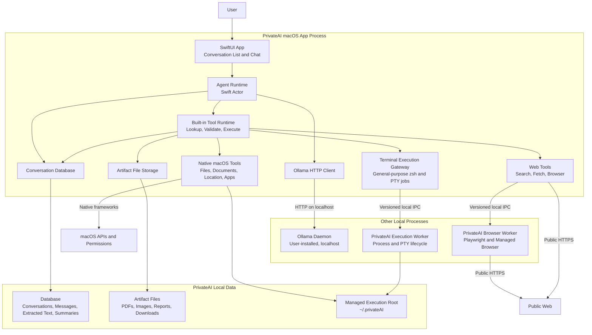
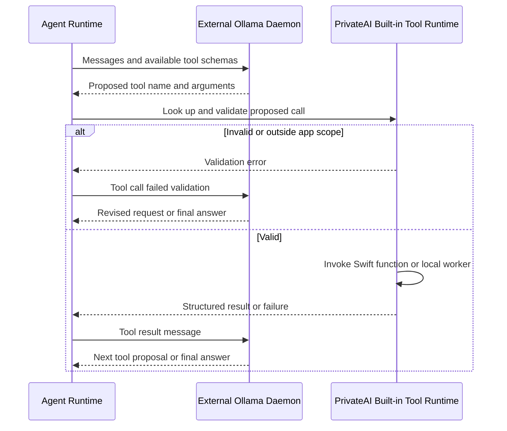
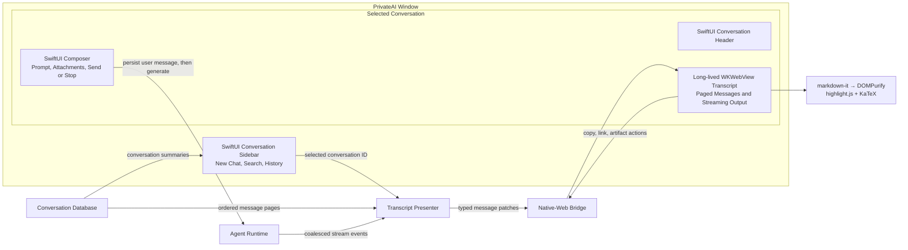
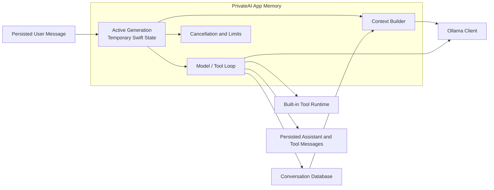
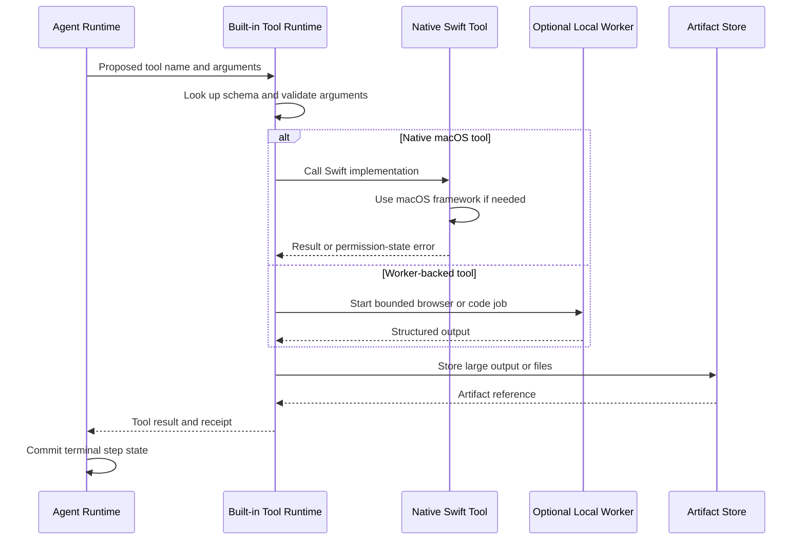
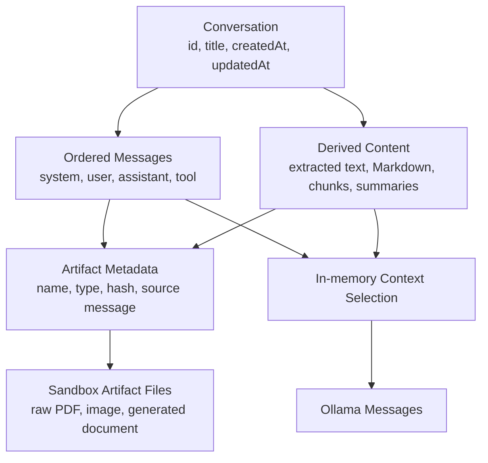
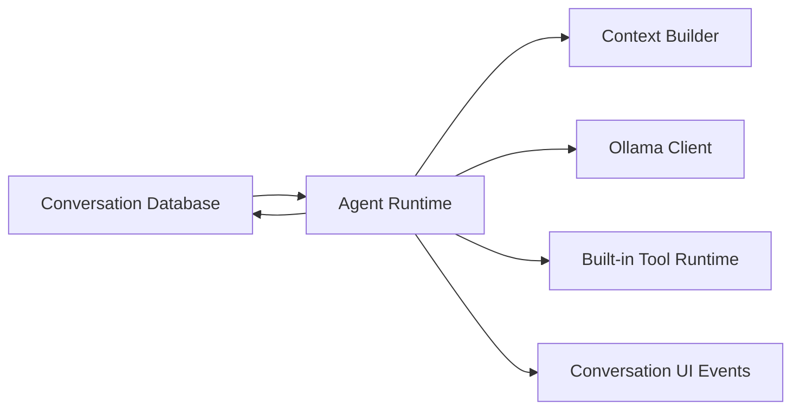
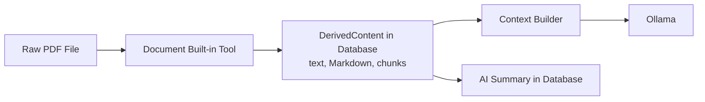

# PrivateAI Target Architecture (Draft)

- Status: Draft
- Date: 2026-08-29
- Scope: Target architecture for a general-purpose, on-device macOS agent

## Purpose

PrivateAI should evolve from a local chat client into an on-device agent that can complete multi-step tasks and deliver verifiable artifacts. It should be able to work with documents, public web content, an isolated browser, code, and local resources available to the app while keeping private inference and durable state on the Mac.

This architecture is derived from the target product capability. It is not constrained by the current class structure, and it does not describe the current implementation.

All components, libraries, process boundaries, persistence choices, and provider integrations in this draft are proposed target design unless an item is explicitly marked **Accepted**. They must not be used as evidence that a capability currently exists. During the rebuild, each concrete choice must be revalidated against a focused implementation slice and recorded as accepted, revised, or open.

The following product requirements are accepted independently of the implementation details: a ChatGPT-like conversation experience, a conversation list beside the selected chat, web-based rendering of LLM-authored Markdown, mathematical formula rendering, correct copying of source Markdown, code, and TeX, and general-purpose local terminal execution comparable in expressive power to the user's Terminal. The exact WebKit bridge, JavaScript libraries, persistence engine, model adapter, and worker topology remain proposed in this draft.

The central design rule is:

> The model proposes actions, but the Agent Runtime owns execution.

The model never receives ambient authority over the filesystem, browser, network, credentials, or operating system. Every action is validated, executed, recorded, and bounded by application-owned components.

## Architecture Views

No single diagram should describe component ownership, runtime sequence, security boundaries, and persistence at the same time. The following views deliberately answer different questions.

### View 1: Global Component Map

**Question:** What runs where, and how do the concrete components communicate?



The proposed Agent Runtime is not a separate server. In this draft it is a Swift actor inside the PrivateAI app process, with Ollama represented as the initial localhost model adapter. This provider choice and adapter boundary must be revalidated during implementation; any provider performs inference but does not own task state, tools, or files.

All capabilities offered to the model are PrivateAI built-in tools. Native macOS capabilities are especially suitable because the app can call platform frameworks directly and handle their permission state locally. A macOS permission prompt, denial, or unavailable capability is part of that tool's execution result, not a separate Agent approval system.

This draft proposes a separate local browser worker because Playwright and its browser process tree may require stronger isolation and cancellation than in-process native tools. The packaging and sandbox boundary remain open. If adopted, the worker is an implementation detail of built-in browser tools, not part of the model provider or a separate product capability surface.

The database is the durable product model. It stores the conversation list, ordered messages, tool calls and results, extracted document text, generated text, summaries, and artifact metadata. The filesystem stores only file-shaped artifacts such as source PDFs, images, generated reports, and downloads.

### Tool Calling Contract

**Question:** Does Ollama execute a tool, or does PrivateAI execute its own function?

Ollama never executes a PrivateAI tool. Ollama only returns a structured request that names a tool and supplies proposed arguments. PrivateAI decides whether to accept that request and, if accepted, invokes its own Swift function or local worker.

The word "invoke" must be qualified in this architecture:

- **Tool-call proposal:** Ollama generates a tool name and arguments in its response.
- **Tool execution:** PrivateAI invokes a Swift implementation or sends a job to a PrivateAI-managed local worker.

Only the second operation causes a real effect. A tool-call proposal has no authority by itself.



#### Step 1: PrivateAI Advertises Available Tools

PrivateAI sends tool schemas as part of an Ollama chat request. A schema describes a name, purpose, argument object, and required fields. It does not give Ollama a function pointer, process handle, filesystem permission, or credential.

Conceptually, PrivateAI sends:

```json
{
    "model": "qwen3",
    "messages": [
        { "role": "user", "content": "Find the latest Ollama release" }
    ],
    "tools": [
        {
            "type": "function",
            "function": {
                "name": "web_search",
                "description": "Search the public web",
                "parameters": {
                    "type": "object",
                    "properties": {
                        "query": { "type": "string" }
                    },
                    "required": ["query"]
                }
            }
        }
    ]
}
```

#### Step 2: Ollama Proposes a Tool Call

The model may return a structured call such as:

```json
{
    "name": "web_search",
    "arguments": {
        "query": "latest Ollama release"
    }
}
```

At this point, no search has happened. This object is untrusted model output. The Built-in Tool Runtime must look up the registered tool and validate its argument shape, values, and operating bounds. A valid call executes automatically without asking the user for per-call approval.

#### Step 3: PrivateAI Validates and Executes Its Implementation

The Built-in Tool Runtime maps the validated name to an implementation PrivateAI owns and executes it immediately. A native macOS tool may be a normal async Swift function using platform frameworks:

```swift
let result = try await locationTool.execute(
    fields: [.city, .region]
)
```

A browser or code tool may instead delegate a bounded job to a PrivateAI-managed worker:

```swift
let result = try await browserWorker.execute(
    validatedJob,
        deadline: deadline
)
```

Ollama has no reference to either implementation. It cannot call them directly, bypass PrivateAI validation, or expand the app's available scope.

#### Step 4: PrivateAI Returns the Result to Ollama

PrivateAI records the execution receipt and sends a tool-result message back to Ollama. The result contains bounded text and artifact references rather than unrestricted local data. Ollama then uses that result to propose another action or produce a final answer.

#### Ownership Summary

| Responsibility | Owner |
| --- | --- |
| Define and advertise available tool schemas | PrivateAI |
| Propose a tool name and arguments | Ollama model |
| Validate arguments | PrivateAI |
| Look up, validate, and execute the call automatically | PrivateAI Built-in Tool Runtime |
| Invoke native Swift functions | PrivateAI Built-in Tool Runtime |
| Start and cancel browser or code workers | PrivateAI Built-in Tool Runtime |
| Access files, network destinations, or browser state available to the app | PrivateAI tool implementation |
| Record receipts and artifacts | PrivateAI |
| Interpret tool results and continue reasoning | Ollama model |

Ollama must never directly receive:

- Swift function references or executable callbacks
- General filesystem access
- Shell or process-launch authority
- Browser automation handles
- Raw credentials or Keychain access
- Authority to expand the app's execution scope

This draft proposes no blanket per-tool approval dialog: sending a chat request may start autonomous execution across enabled built-in tools. The confirmation policy for consequential actions remains a product and security decision and must be recorded before those tools ship. A tool that needs a protected macOS capability would call the relevant framework and report success, unavailable, denied, cancelled, or failed.

### View 2: Conversation UI and Markdown Rendering

**Question:** How does the app provide a ChatGPT-like conversation experience while rendering all model output consistently?



The target experience uses a two-column layout. This draft proposes SwiftUI `NavigationSplitView`: the left sidebar contains the conversation list and conversation-level actions, while the right detail column contains a fixed header, a scrollable transcript, and a composer anchored below it. Collapsing the sidebar changes available width but does not create a second copy of conversation state.

The accepted requirement is a native macOS shell with a web-rendered Markdown transcript. This draft proposes SwiftUI for window chrome, navigation, the conversation list, composer, attachment picking, menus, and accessibility focus, with one long-lived local `WKWebView` for the selected transcript. The implementation should avoid one web view per message because that fragments selection, scrolling, accessibility, memory use, and keyboard behavior.

#### Transcript Content Contract

The database stores the original message content as UTF-8 Markdown. LLM text is Markdown by default; it is not converted into attributed text or persisted HTML. The same renderer is used for completed messages, streaming assistant messages, historical messages, retries, and regenerated responses.

The proposed bundled, versioned rendering pipeline is:

1. `markdown-it` parses Markdown with the product's explicit option and plugin set.
2. The renderer creates HTML for headings, paragraphs, lists, tables, block quotes, links, task lists, fenced code, inline code, and other supported Markdown constructs.
3. KaTeX renders TeX math delimited by `$...$`, `$$...$$`, `\\(...\\)`, or `\\[...\\]`, while preserving the source TeX for copying and recovery.
4. `highlight.js` applies language-aware syntax highlighting to fenced code without changing the stored code text.
5. DOMPurify sanitizes the resulting DOM before it is attached to the transcript.
6. A bundled CSS theme maps semantic HTML to PrivateAI typography, spacing, code, table, quote, link, tool, error, and math styles in light, dark, increased-contrast, and Dynamic Type-equivalent modes.

If this stack is adopted, the parser configuration, enabled plugins, sanitizer policy, KaTeX version, highlighting version, and CSS contract must be application resources covered by renderer fixtures. No message may supply executable script, event handlers, remote stylesheet, iframe, or arbitrary web content. External image loading is disabled by default; links and artifact references are routed to native policy handlers.

#### Streaming and Updates

The Transcript Presenter converts database pages and Runtime stream events into typed bridge operations such as `replaceConversation`, `prependMessages`, `appendMessage`, `updateMessageContent`, and `setMessageStatus`. Every operation carries stable conversation and message IDs. The bridge accepts structured values, never generated JavaScript source assembled by string concatenation.

Streaming deltas are coalesced to a display cadence before the active assistant message is reparsed. Temporary incomplete Markdown or TeX is shown as readable text until enough input arrives; the final persisted content always receives a full render. Completed historical messages are not rerendered for each token. Switching conversations rejects late operations whose conversation ID no longer matches the selected transcript.

The transcript preserves the user's reading position. It follows a streaming response only while the user is already near the bottom; scrolling upward suspends auto-follow and exposes a return-to-latest control. Prepending an older message page restores the previous visual anchor instead of jumping the viewport.

#### Copy and Interaction Semantics

- Normal web selection copies the visible plain text across message boundaries.
- Copy Message copies the exact original Markdown stored for that message, including Markdown syntax and TeX delimiters.
- Each fenced code block offers Copy Code, which copies the original unhighlighted code payload without line numbers or generated markup.
- Each rendered formula offers Copy TeX, which copies its original TeX source rather than KaTeX HTML.
- Links, citations, tool details, and artifacts emit typed native actions with stable IDs; message HTML cannot invoke arbitrary Swift methods.

Copy behavior is validated with round-trip fixtures containing nested lists, tables, fenced code, Unicode, inline and display math, escaped delimiters, and mixed Markdown. Rendering failure must leave the original Markdown readable and copyable rather than producing an empty message.

### View 3: One Assistant Generation in Memory

**Question:** What exists in memory after the user sends one message?



`Active Generation` is not a database entity. It is temporary Swift state for one assistant response. It starts when a user message is sent and disappears when the response completes, fails, or is cancelled.

The Runtime owns these invariants:

- One model/tool loop exists for the active assistant response.
- Every user, assistant, and tool event is appended to the conversation in order.
- Budgets and cancellation are checked before every external operation.
- Completion, failure, and cancellation are recorded on the corresponding message.
- UI lifecycle changes do not alter execution correctness.

### View 4: Built-in Tool Execution

**Question:** How does a model-proposed action become a bounded operation executed by PrivateAI?



The proposed Built-in Tool Runtime is the model-facing capability surface owned by PrivateAI. It contains a registry of typed tool definitions and routes valid calls to concrete implementations. This draft prefers in-process native macOS tools and reserves a separate worker for implementations that require process isolation or process-tree cancellation; the exact worker boundary remains open.

System permission handling stays inside the native tool that needs it. For example, a location tool uses Core Location and returns the resulting location or a clear denied/unavailable error. The Agent Runtime does not model permission approval as a separate task step.

### View 5: Conversation Data and Artifact Files

**Question:** What belongs in the database, what belongs on disk, and what is rebuilt in memory?



The conversation is the database aggregate. The conversation list is a query ordered by `createdAt` or `updatedAt`; it does not require one physical directory per conversation. Artifact files may be grouped under a stable conversation identifier inside the sandbox, while timestamps and display order remain database fields.

Each message has one of four roles:

- `system`: an explicitly persisted system event when the product needs one in the durable timeline
- `user`: human input and references to attached artifacts
- `assistant`: Ollama-generated text or proposed tool calls
- `tool`: results returned by PrivateAI built-in tools

Request-scoped system instructions are assembled in memory and are not persisted as conversation messages. Historical summaries are `DerivedContent` with source and generator provenance; they are not stored as synthetic `system` messages.

Raw PDF bytes remain in sandbox artifact storage. Parsed text and Markdown representations are stored in the database as derived content linked to the source artifact and parser version. AI-generated summaries are also stored in the database with their source relationship. Later generations use this stored representation and do not reopen and parse the original PDF unless the derived content is missing, invalid, or requires a newer parser.

The Context Builder reconstructs the next Ollama request in memory from recent messages, compacted historical summaries, relevant extracted chunks, and artifact references. Full historical content remains in the database even when only a summary or sample is selected for the current model context.

### Dependency Rules

The prohibited dependencies are architectural constraints, not implementation preferences:

- A model cannot invoke a tool directly.
- A model cannot access the filesystem, browser, network, credentials, or macOS services directly.
- The UI cannot own the agent loop or execute domain tools directly.
- A tool cannot expand its own filesystem, network, or process scope.
- The database conversation timeline is the durable record of user, assistant, and tool activity.
- A tool result is successful only after its tool message and artifact references are committed.
- `ConversationDatabase` is the only database write boundary. UI, Runtime, and tools submit typed mutations rather than writing tables directly.
- A model-assisted planner, evaluator, or summarizer never calls Ollama independently; the Agent Runtime coordinates every model request, budget, and cancellation path.

## Component Designs

Every component section uses the same contract: purpose, owned responsibilities, interactions, state, failure and cancellation behavior, and prohibited responsibilities. These contracts define product boundaries; Swift protocols and concrete types may be chosen during implementation.

### Conversation UI

**Purpose**

Present the conversation list, ordered message timeline, composer, streaming response, tool activity, generated files, and retry or cancellation controls.

**Owns**

- The two-column window layout: conversation sidebar on the left and selected chat on the right
- Rendering database-backed messages through the bundled Markdown transcript
- Capturing human input and selected files
- Starting, cancelling, retrying, or regenerating one assistant response
- Displaying built-in tool progress and artifact links
- Search, selection, keyboard navigation, responsive sidebar collapse, and transcript scroll behavior
- Native-Web Bridge schemas, renderer assets, sanitization policy, and copy semantics

**Interactions**

- Reads conversation summaries and messages from the Conversation Database
- Appends a `user` message before asking the Agent Runtime to generate a response
- Observes transient streaming events from the Agent Runtime and coalesces them into typed transcript patches
- Opens artifact files through Artifact Storage metadata
- Routes links, citations, copy commands, and artifact actions from the transcript through native policy handlers

**State**

Only presentation state: selected conversation ID, draft text, sidebar visibility, transcript page window, scroll anchor, open panels, and transient rendering state. Conversation history and original Markdown are not owned by the view hierarchy or WebKit DOM.

**Failure and cancellation**

The UI shows the terminal state already stored on the assistant or tool message. Closing a window must not fabricate a successful response. Stop sends cancellation to the active generation and waits for its terminal message state. A renderer or native-web bridge failure falls back to readable source Markdown and must not alter the persisted message. Reloading the web process reconstructs the transcript from the database and current transient stream snapshot.

**Must not**

- Call Ollama directly
- Execute built-in tools directly
- Construct authoritative conversation history from view state
- Persist raw artifact bytes inside UI state
- Persist rendered HTML as the authoritative message content
- Load renderer code, styles, fonts, or math assets from a CDN
- Allow message content to execute scripts or call unrestricted native bridge methods

### Agent Runtime

**Purpose**

Coordinate one active assistant generation after a user message has been persisted.

**Owns**

- Creating and destroying the in-memory `ActiveGeneration`
- Asking the Context Builder for the next Ollama message set
- Calling the Ollama Client
- Receiving model text and proposed tool calls
- Sending proposed calls to the Built-in Tool Runtime
- Appending assistant and tool messages in conversation order
- Enforcing round, token, time, output, and cancellation limits

**Interactions**



**State**

`ActiveGeneration` exists only in memory and is keyed by conversation and initiating user message. It contains cancellation handles, current model round, accumulated model-facing messages, generation limits, and IDs of messages currently being written.

No persistent `Task`, `Run`, `Step`, or `Checkpoint` entity is created.

**Failure and cancellation**

- Ollama failure creates or updates a failed assistant message.
- Tool failure creates a terminal `tool` message, then the Runtime may return that result to Ollama for recovery.
- Cancellation stops the Ollama stream and active built-in tool, then marks the current message cancelled or stopped.
- On app restart, incomplete message states are normalized to interrupted; Swift continuation state is never reconstructed.

**Must not**

- Parse PDFs, browse pages, run shell commands, or implement other tools
- Own durable conversation data outside database transactions
- Ask the UI to infer whether execution succeeded
- Give Ollama direct access to executable functions

### Context Builder

**Purpose**

Build the bounded in-memory message set sent to Ollama for the next model round.

**Owns**

- Selecting system instructions
- Selecting recent `user`, `assistant`, and `tool` messages
- Preserving complete tool-call and tool-result pairs
- Selecting compacted historical summaries
- Retrieving relevant document chunks and derived content
- Enforcing the model context-window budget and output reserve

**Interactions**

- Reads messages, summaries, derived content, and artifact metadata from the Conversation Database
- Receives the newest user message and generation limits from the Agent Runtime
- Returns an in-memory array of Ollama messages plus a context receipt describing selected and omitted content

**State**

The assembled context is temporary memory. Reusable extracted text, chunks, and summaries remain in the database and are referenced by stable IDs.

**Failure and cancellation**

If mandatory content cannot fit, it returns a context-too-large error before Ollama is called. Retrieval and summarization work must honor generation cancellation.

**Must not**

- Reparse an artifact when valid derived content already exists
- Modify conversation history to make it fit
- Treat an arbitrary sample as the complete source
- Execute tools or call macOS APIs

### Ollama Client

**Purpose**

Communicate directly with the user-installed external Ollama daemon over its localhost HTTP API.

**Owns**

- Encoding chat messages, model options, images, and built-in tool schemas
- Streaming and decoding text, thinking content, usage data, and proposed tool calls
- Version and readiness checks
- Transport timeout and request cancellation
- Mapping Ollama protocol errors into stable PrivateAI errors

**Interactions**

- Receives a complete bounded request from the Agent Runtime
- Calls the external Ollama daemon on an allowed loopback URL
- Streams model events back to the Agent Runtime

**State**

Only request-scoped transport state. Model files, model processes, and inference memory are owned by Ollama, not PrivateAI.

**Failure and cancellation**

Daemon unavailable, missing model, timeout, malformed stream, and context overflow are distinct errors. Cancelling a generation cancels its HTTP request without affecting stored conversation history.

**Must not**

- Execute a proposed tool call
- Read or write the Conversation Database
- Access artifact files except request-scoped image data supplied by the Runtime
- Decide whether the assistant response is complete

### Built-in Tool Runtime

> **Architecture decision:** Every local capability exposed to the LLM is a PrivateAI Built-in Tool. Native macOS capabilities are not a separate permission subsystem, and worker-backed capabilities are not a separate tool platform.

**Purpose**

Provide the single model-facing catalog through which PrivateAI validates and executes all local capabilities.

**Catalog shape**

The model-facing catalog stays small and stable. Product tasks such as weather, YouTube lookup, news, repository repair, or nearby restaurants are not separate tools. They are goals completed by composing a bounded set of capability gateways:

| Gateway | Operations |
| --- | --- |
| `local_resources` | Read, search, import, and write app-authorized files, documents, and artifacts |
| `apple_services` | Location, MapKit search, Calendar, Contacts, and other approved native framework actions |
| `terminal` | General-purpose local terminal commands, installations, builds, tests, scripts, and long-running jobs through the planned `TerminalTool` gateway |
| `web` | Public search and fetch |
| `browser` | Stateful page navigation and interaction through the isolated browser worker |

Each gateway uses a validated `action` plus action-specific arguments. The Runtime may advertise only gateways available in the current build and execution scope. Adding a website, content type, or user task must not create another model-facing tool when an existing gateway can express it. This bounds prompt growth and keeps capability selection stable as product coverage expands.

**Tool completion contract**

A schema, `LLMTool` conformance, request type, backend protocol, registry entry, fixture, or mocked result does not by itself implement a capability. A built-in Tool is complete only when it includes the real bounded executor for every advertised action and has evidence at three levels:

1. A deterministic contract test verifies schema, strict argument validation, result encoding, limits, cancellation, and concurrency policy.
2. A direct integration test executes the claimed macOS framework, filesystem operation, network request, or isolated worker and verifies the real result or an explicit unavailable, denied, timeout, or failure state.
3. A model-driven end-to-end test gives the real Ollama model the production Tool schema, asks a natural-language question without forcing a Tool choice, executes the real implementation, returns its result to the model, and verifies task completion.

An unavailable external service or protected capability may make the Tool partially implemented or blocked; it must not be replaced by fixture output and reported as complete. General-purpose terminal execution is a primary Agent capability, not a restricted fallback. Dedicated file, PDF, web, and native framework Tools still provide structured results, explicit permission states, and more reliable semantics when the model selects them.

**Owns**

- Typed tool names, descriptions, argument schemas, result schemas, and implementation registration
- Deterministic lookup and argument validation
- Automatic execution without a PrivateAI per-call approval dialog
- Cancellation routing and output limits
- Conversion of implementation output into a bounded `tool` result
- Creation of derived content and artifact metadata when a tool produces reusable output

**Interactions**

- Supplies available tool schemas to the Agent Runtime for each Ollama request
- Receives untrusted model-proposed names and arguments from the Agent Runtime
- Invokes an in-process Native Tool or a Worker-backed Tool
- Writes reusable derived content and artifact metadata through the Conversation Database
- Returns a structured result to the Agent Runtime, which persists the ordered `tool` message

**State**

The tool catalog is application configuration. Individual executions are request-scoped and keyed by tool-call ID so cancellation and duplicate-result protection are deterministic.

**Failure and cancellation**

Unknown tool, invalid arguments, unavailable macOS capability, permission denial, timeout, oversized output, worker crash, and cancellation are structured tool results or errors. Tool execution receipts use `proposed`, `running`, `succeeded`, `failed`, `cancelled`, `interrupted`, or `unknownOutcome`. `unknownOutcome` is used when an external side effect may have occurred but cannot be proven after interruption, and it is never replayed automatically. The Runtime decides whether to send the failure back to Ollama for recovery.

**Must not**

- Invent additional filesystem, network, or process access from model arguments
- Append conversation messages out of order
- Call Ollama directly
- Decide that the overall assistant response is complete

### Native Tools

**Purpose**

Implement built-in capabilities that are most naturally and reliably provided by Swift and macOS frameworks.

**Owned implementations**

| Capability | Native implementation behavior |
| --- | --- |
| Current location | Uses Core Location and returns bounded requested fields or a permission-state error |
| Files and folders | Uses security-scoped URLs and native file APIs for resources available to the app |
| Document import | Copies source files into artifact storage, extracts content, and records provenance |
| Document generation | Writes a generated file and records artifact metadata linked to its source message |
| Device context | Uses supported frameworks to return only requested device, locale, power, or storage fields |
| Public web fetch | Uses a bounded network client and returns readable content with source metadata |

**Interactions**

Native Tools are invoked only by the Built-in Tool Runtime. They may call macOS frameworks, the Conversation Database, and Artifact Storage through narrow inputs supplied for that execution.

**State**

No conversation-level state. Parser caches may exist, but reusable parser output belongs in `DerivedContent` records.

**Failure and cancellation**

macOS permission prompts and authorization status are platform behavior inside the relevant tool. The tool returns success, denied, unavailable, cancelled, or failed. It does not create a separate Agent approval workflow.

**Must not**

- Receive the entire conversation unless its schema explicitly requires selected context
- Expose security-scoped URLs, credentials, or unrestricted paths to Ollama
- Hide partial or failed extraction as success

### Terminal Execution Subsystem and Worker-backed Tools

The detailed execution contract, managed directory layout, event flow, and secret-input boundary are specified in [Terminal Execution Design](terminal-execution-design.md).

**Purpose**

Provide general-purpose local terminal execution and implement other built-in tools that require process isolation, non-Swift runtimes, PTY semantics, or process-tree cancellation. Terminal execution is intended to use the commands and runtimes available to the user rather than a command or executable allowlist.

**Owns**

- Versioned local job and result protocol
- Child-process startup, health checking, deadlines, and process-tree termination
- Pipe and PTY execution with streaming stdout and stderr
- Long-running job state, cancellation, and interruption recovery
- Managed browser profiles and execution files
- Bounded stdout, stderr, screenshots, downloads, and structured results

**Interactions**

The Built-in Tool Runtime sends one validated job. For terminal work, the job contains the complete command, working directory, environment additions, interaction mode, and lifecycle limits; validation protects protocol integrity and user-selected policy but does not reduce the shell to a command allowlist. The worker streams process events to the App, stores the complete local log, and returns a bounded structured summary to the Agent Runtime and model.

**State**

PrivateAI creates `~/.privateAI` on first use as its managed execution root. Commands default to a job or workspace directory beneath this root, and PrivateAI keeps execution workspaces, job metadata, logs, and retained artifacts in named subdirectories there. This root is an ownership and lifecycle convention, not a claim that arbitrary shell commands are technically confined to it; commands execute with the permissions of the PrivateAI execution process, and broader filesystem access follows the App's distribution, sandbox, and user-authorization model. A Playwright profile remains isolated from the user's normal browser profile by default.

High-volume stdout and stderr are streamed to the App UI and complete logs remain local. The model receives bounded milestones when a decision is required and a structured final result containing status, exit code, duration, output tails, truncation state, and artifact references. The Runtime must not repeatedly invoke the model for ordinary progress lines.

Interactive jobs use a PTY when terminal semantics are required. Passwords, passphrases, tokens, and other secret input are entered through an App-owned secure UI and written directly to the PTY through an ephemeral channel. Secret input never becomes a tool argument, model message, progress event, conversation record, or execution log. Privileged system changes require an explicitly designed macOS authorization/helper boundary; sending a password to `sudo` through model-visible data is not supported.

**Failure and cancellation**

Startup failure, protocol mismatch, deadline, browser crash, process exit, output overflow, and cancellation are explicit results. Cancellation terminates descendants, not only the top-level worker process.

**Must not**

- Be advertised to Ollama as a second tool system
- Read the Conversation Database directly
- Use the user's everyday browser profile by default
- Send secret interactive input to Ollama or persist it in logs
- Describe `~/.privateAI` as a security sandbox unless process isolation actually enforces that boundary

### Conversation Database

**Purpose**

Provide the durable logical container for every conversation and all reusable textual content associated with it.

**Logical records**

| Record | Required responsibility |
| --- | --- |
| `Conversation` | ID, title, creation time, update time, model and conversation settings |
| `Message` | Conversation ID, stable sequence, role, content, status, tool-call linkage, timestamps |
| `ArtifactBlob` | Content hash, media type, file location, byte size, and global lifecycle |
| `DerivedContent` | Source blob or message, representation type, text or chunk content, parser or generator version |
| `ConversationArtifact` | Conversation, source message, blob reference, display name, and conversation-specific lifecycle |

Messages use the Ollama-compatible roles `system`, `user`, `assistant`, and `tool`. `user` is the protocol name for human input. An assistant tool proposal and its tool result are connected by a stable tool-call ID.

**Interactions**

- Conversation UI queries the conversation list ordered by creation or update time and reads message pages
- Agent Runtime appends and updates assistant and tool messages
- Context Builder reads selected messages, summaries, and derived content
- Built-in Tools write extracted text, summaries, and artifact metadata
- Artifact Storage resolves metadata to sandbox files

**State and ordering**

`Conversation` is the aggregate root for chat history. Message sequence is allocated only by `ConversationDatabase` and is stable and unique within a conversation. An assistant tool proposal and its initial receipt are committed together. A terminal tool message and its `ConversationArtifact` references are committed together so the timeline never points to missing metadata.

`ArtifactBlob` and reusable `DerivedContent` are global content-addressed records. `ConversationArtifact` links a conversation and source message to a blob. Deleting one conversation removes its references but does not delete a blob or derived content still reachable from another conversation. Unreferenced content is reclaimed separately.

The conversation is a database concept, not a requirement for one physical directory containing all data. Artifact files may be grouped by stable conversation ID while the database remains authoritative for creation time, ordering, relationships, and display.

**Failure and recovery**

An assistant message left streaming after process termination becomes interrupted on next load. A read-only tool proposal without a terminal result becomes interrupted. A tool with a possible external side effect becomes `unknownOutcome` when completion cannot be proven. Retry or regenerate creates normal new conversation messages; `unknownOutcome` is not automatically replayed and no in-memory continuation is restored.

**Must not**

- Store raw PDF, image, archive, or generated-document bytes in ordinary message rows
- Delete source relationships when content is summarized or compacted
- Replace full durable history with only the current model context

### Artifact Storage

**Purpose**

Store file-shaped source material and generated outputs inside the PrivateAI sandbox while the Conversation Database stores their identity and relationships.

**Owns**

- Raw imported files such as PDF, image, text bundle, or archive inputs
- Generated files such as Markdown, PDF, DOCX, code patches, screenshots, and downloads
- Stable sandbox locations, atomic writes, hashes, byte sizes, deletion, and export

**Interactions**



`ArtifactBlob` metadata is created in the Conversation Database and points to a content-addressed file. `ConversationArtifact` records which conversations and messages use that blob. A practical physical layout may use `Artifacts/<hash-prefix>/<content-hash>`, while display names, timestamps, and conversation relationships remain database metadata rather than path identity.

**State and reuse**

Raw PDF bytes remain on disk. Extracted text, Markdown representation, chunks, parser version, and AI summaries are database content linked to that file. Later generations reuse valid derived content instead of reparsing the PDF.

Reprocessing occurs only when derived content is missing, corrupt, incompatible with the current parser version, or the source hash has changed.

**Failure and cancellation**

Copy, parse, write, hash, and export failures are explicit. A database record must not point to a partially written file; temporary files are promoted atomically only after successful completion.

**Must not**

- Determine conversation ordering or message roles
- Put raw file bytes into Ollama context
- Treat a generated summary as the original extracted text
- Lose provenance between source file, derived representation, summary, and generated output

## Example: Research and Produce a Document

```mermaid
sequenceDiagram
    actor U as User
    participant UI as macOS UI
    participant R as Agent Runtime
    participant M as Ollama
    participant T as Built-in Tool Runtime
    participant B as Browser Worker
    participant A as Artifact Store

    U->>UI: Send a message requesting research and a report
    UI->>R: Start Active Generation
    R->>M: Goal, context, and available built-in tools
    M-->>R: Proposed search tool call

    R->>T: Execute web_search
    T-->>R: Search results and sources

    R->>T: Submit BrowserJob
    T->>B: Run isolated browser task
    B-->>T: Snapshot, text, links, screenshot
    T->>A: Store evidence Artifact
    T-->>R: ToolResult and ArtifactRef

    R->>M: Provide evidence and report requirements
    M-->>R: Report draft
    R->>T: Write draft into managed workspace under ~/.privateAI
    T->>A: Store report with provenance
    A-->>R: Report Artifact

    R->>M: Ask whether requirements, claims, and citations are complete
    M-->>R: One material source is missing; continue

    R->>T: Read the missing source
    T-->>R: Additional evidence
    R->>A: Store a new report version
    R->>M: Re-evaluate completion
    M-->>R: Final answer and completed report

    R-->>UI: Result, report, sources, and execution trace
    UI-->>U: Preview, diff, or export
```

## Required Runtime Properties

- **Durability:** User, assistant, and tool activity is appended to the conversation database; file-shaped outputs are linked through artifact metadata.
- **Cancellation:** Cancelling the active generation stops model streams, built-in tool work, browser and code process trees, artifact commits, and further model calls.
- **Interruption handling:** After restart, incomplete assistant or tool messages are marked interrupted and can be retried through normal chat behavior. In-memory execution is not silently resumed.
- **Managed execution:** Terminal commands are general-purpose, while every active generation and job still has explicit cancellation, status, logging, output-size handling, and configurable lifecycle limits.
- **Provenance:** Derived content and generated artifacts retain links to their source artifacts, messages, parser versions, and producing tools.
- **User-controlled authority:** Terminal jobs run locally with the authority granted to the execution process by the user and macOS; Ollama receives no process handle, credential, or independent authority.
- **Provider independence:** Replacing or adding a local model provider does not change validation, execution, persistence, or UI ownership.
- **Inspectable behavior:** Users can see meaningful progress, failures, produced artifacts, and recovery options.

## Scope Boundaries

This draft does not define:

- A multi-agent organization or distributed scheduler
- A general workflow language or arbitrary DAG engine
- Model access to credentials or secret interactive input
- Automatic replay of actions with external side effects
- Guaranteed parity with a cloud product based only on tool count
- A migration plan from the current implementation

Those decisions require separate capability, security, product, and acceptance records after this target architecture is reviewed.

## Open Decisions

1. Which initial conversation journey should prove the architecture: evidence-backed document production, repository work, or browser task completion?
2. Which browser capabilities remain in the App process, and which require a separately signed direct-distribution worker?
3. Which direct-distribution, App Sandbox, security-scoped bookmark, and execution-worker topology preserves general-purpose terminal capability while making filesystem authority clear to users?
4. Which capabilities are enabled by default, and which protected resources require macOS system permission?
5. What artifact retention, encryption, deletion, and export guarantees form the first release contract?
6. Which deterministic evaluation set defines the minimum quality baseline before comparing model or prompt changes?
